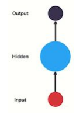
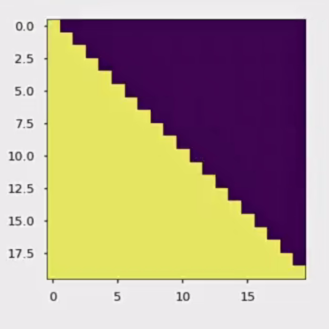

#  pytorch and NLP

## 1 pytorch操作  

### 1.1 tensor操作

[代码 :1_tensor_opera.py](1_pytorch\1_tensor_opera.py) 

创建矩阵 demo0

- 未初始化的矩阵
  - torch.empty()    --> return: 脏数据(不清理内存
- 初始化矩阵
  - torch.rand()    --> return: 均匀分布的  [0, 1)
  - torch.randn()    --> return: 标准正态分布
- 创建全零的矩阵
  - **torch.zeros(size, dtype)**,dtype用
- 根据array或者ndarray直接创建tensor张量
  - **Torch.tensor(array)** 

上述方法_like(x)可以用于创建具有和x相同形状的tensor 

​	

加法操作demo1

- x.add_(y) inplace操作,修改x,其他加法不会修改原数据
- 所有in-place的操作函数都有一个下划线的后缀
  比如x.copy-(y),x.add_(y),都会直接改变x的值

修改形状demo2
x.size()方法和x.shape属性一样,结果都是tensor的形状
x.view()用于修改形状,等价于np.reshape()
x.item() 如果x仅有一个元素,可以直接输出元素值
x.tolist() 转换为array数组 a[0,0].tolist()用于获取[0,0]处元素,因此

```python
x[0,0].tolist()
x[0,0].item()
```

上述两行代码等价


tensor和array之间的转化  demo3

- **tensor和array可以共享底层内存空间**
- **tensor --> array;   tensor.numpy()**
- **Array --> tensor:   torch.from_numpy()**


tensor.to()用于将数据移动到任意设备上 demo4

```python
def demo4(): #数据转移到GPU上的标准流程
    x=torch.ones(5,3)
    if torch.cuda.is_available():
        # 定义一个设备对象, 这里指定成CUDA, 即使用GPU
        device = torch.device('cuda')
        # 直接在GPU上创建一个Tensor
        y = torch.ones_like(x, device=device)
        print("y在GPU上")
        # 将在CPU上面的x张量移动到GPU上面
        x = x.to(device)
        print("x在GPU上")
        # x和y都在GPU上面, 才能支持加法运算
        z = x + y
        # 此处的张量z在GPU上面
        print(z)
        # 也可以将z转移回CPU上面, 并同时指定张量元素的数据类型
        print(z.to('cpu', torch.double))
    print('执行完成====')
```

两个数据如果要进行运算,必须在同一设备上 


### 1.2 autograd自动求导

[代码](1_pytorch\2_autograd.py) 

demo0

- torch.tensor (类)

  - 解释:     

    - 1. .requires_grad = True--> 表示要进行所有操作的追踪
      2. 要进行反向传播:   .backward()   前提是.requires_grad属性设置为True
      3. 计算之后的梯度存放:    .grad()    (累加的)
      4. 要想终止一个tensor的反向传播    .detach()
      5. 终止整个的反向传播的过程, 官方推荐:       with torch.no_grad()   --> 一般在预测阶段使用
      6. 用户自己定义的tensor张量默认    grad_fn = None
- tensor操作

  - 用户自定的张量:    requires_grad=False(default)
  - 如果想要原地改变    requires_grad_(True)

- 在整个Pytorch框架中，所有的神经网络本质上都是一个autograd package类
- autograd package提供了一个**对Tensors.上所有的操作进行自动微分**的功能.

将**class.requires_grad设置为True**, 将**追踪class上定义的所有操作**. 当代码要进行反向传播的时候, **直接调用.backward()就可以自动计算所有的梯度.** 

如果想**终止⼀个Tensor在计算图中的追踪回溯**, 只需要执行**tensor.detach()**就可以将该Tensor从计算图中撤下, 在未来的**回溯计算中也不会再计算该Tensor.**

除了.detach(), 如果想**终⽌对计算图的回溯**, 也就是不再进行方向传播求导数的过程, 也可以采用代码块的方式**with torch.no_grad()**:, 这种方式⾮常适用于对模型进行预测的时候, 因为预测阶段不再需要对梯度进行计算.

```python
import torch
import torch.nn as nn #神经网络组件
import torch.nn.functional as F #神经网络方法
```

```python
with torch.no_grad():
    print((x**2).requires_grad) #False
```

## 2神经网络

### 2.1神经网络class搭建和使用

 [neural_networks.py](1_pytorch\3_neural_networks.py)构建了一个两层卷积两层池化三层全连接层的神经网络

创建神经网络的步骤

- 构建神经网络
  - 定义神经网络的类
    - def  \__init__()
    - def forward()  正向传播的过程
    - def num_flat_features() 

- 数据集放入神经网络中进行训练
  - net(input)
- 损失值的计算  loss
  - MSELoss()
  - .grad_fn属性


- ```python
  params=list(net.parameters())#获取参数列表
  ```


反向传播求其梯度

- **在反向传播之前一定要记得:     net.zero_grad()** 从而梯度清零
- 反向传播:    .backward()

 [4_networks_upgrate.py](1_pytorch\4_networks_upgrate.py) 神经网络参数更新,优化器位于`torch.optim`中

标准化代码:

- 创建优化器
- 梯度清零
- 送入模型进行预测
- 根据损失函数 计算损失值
- 反向传播计算梯度
- 更新参数

```python
output=net(input) #前向传播
criterion=nn.MSELoss() #均方误差损失函数
loss=criterion(output,target) #计算损失
loss.backward() #反向传播,计算梯度
optimizer.step() #更新参数
```


#### CIFAR10案例 [5_cifar10.py](1_pytorch\5_cifar10.py) 

- 构建分类器

  - 步骤

    - 1. 下载数据集cifra10数据集

         1. 进行标准化处理
         2. 训练集的下载
         3. 测试集的下载

         注意: 

         ​	使用imshow展示图片

      2. 构建神经网络分类

         1. 两个卷积层  三个全连接层

      3. 定义损失函数和优化器

         1. 损失函数: nn.CrossEntropyLoss()
         2. 优化器: SGD()

      4. 训练神经网路, 并验证

         1. 训练
            1. 数据循环体内
               1. 传入数据
               2. 梯度清零
               3. 数据传入到神经网络进行训练
               4. 损失计算
               5. 反向传播
               6. 参数更新
            2. 模型保存
               1. 定义保存的路径 path
               2. torch.save(net.state_dict(),  path)
         2. 验证
            1. 模型的重加载
               1. 实例化模型
               2. 回复模型    net.load_state_dict(torch.load(path))
            2. With torch.no_grad()

      - 使用GPU服务器
        - 先要判断是否有GPU [cuda]   
          - device = torch.device("cuda:0" if torch.cuda.is_available() else "cpu")
        - 如果有
          - 迁移: 模型    net.to(device)    数据迁移:  data.to(device)

```python
device = torch.device("cuda:0" if torch.cuda.is_available() else "cpu")

# 将模型转移到GPU上

net.to(device)

# 将输⼊的图⽚张量和标签张量转移到GPU上

inputs, labels = data[0].to(device), data[1].to(device)

```


# NLP

自然语⾔处理（Natural Language Processing, 简称NLP）是计算机科学与语⾔学中关注于计算机与⼈类语⾔间转换的领域.


## 1.文本预处理

### 1.1文本预处理中包含的主要环节

#### 文本张量表示方法

- one-hot编码
- Word2vec
- Word Embedding

- 词性标注
  	- 作用: 为了更好的理解 文本
- **命名实体识别(NER)**
  	- 命名实体: 人名    地名  机构名  等专有名词

 - 文本预料的分析
   - 标签数量分析
   - 句子长度的分析
   - 词频的统计和关键词云的绘制
 - **文本特征处理**
   - **添加n_gram特征**
   - 文本长度的规范
 - 数据增强方法
   - 回译增强法(如:中-英-中 ,从而得到一个意思的不同表达)

### 1.2 文本处理的基本方法

分词就是将连续的字序列按照⼀定的规范重新组合成词序列的过程。中文不像英文有天然的分界符 ,因此我们需要分词器将句子拆分成语义的最小单元:词

流行中⽂分词⼯具jieba [1_jieba_cut.py](2_Text_Pre-Processing\1_jieba_cut.py) 

支持用户自定义的模式(自定义词典
	- 先要定义用户自定义的文件   userdict.txt
	- 加载文件到jieba词库    jieba.load_userdict('./userdict.txt')

**命名实体识别**

命名实体: 通常我们将⼈名, 地名, 机构名等**专有名词统称命名实体.** 如: 周杰伦, ⿊⼭县, 孔⼦学院, 24辊方钢矫直机.

顾名思义, 命名实体识别(Named Entity Recognition，简称NER)就是**识别出⼀段文本中可能存在的命名实体**.

**词性标注**

以语法特征为主要依据、兼顾词汇意义对词进行划分

### 1.3 文本张量的表示方法 [2_text_vector.py](2_Text_Pre-Processing\2_text_vector.py) 

将⽂本表示成张量（矩阵）形式，能够使语⾔⽂本可以作为计算机处理程序的输⼊，进行接下来⼀系列的解析工作

- one-hot编码  [2_text_vector.py](2_Text_Pre-Processing\2_text_vector.py) 的onehot_encode方法
  - 优点 操作简单   便于理解
  - 缺点 1. 词与词之间的联系被割断了 2. 数据集比较大, 内存占有比较大

```python
train_onehot_encode和test_onehot_encode方法存储了编码器的训练,保存和调用的过程
```

- word2vec

  - cbow:  **词袋**模式   特点: **两边预测中间**
  - Skipgram:   特点: **中间词预测两边**
  - fasttext安装( [安装包](2_Text_Pre-Processing\fasttext_wheel-0.9.2-cp38-cp38-win_amd64.whl) )
  - fasttext训练词向量

    - 第一步: 获取训练数据
      - 下载数据
      - Wikifil.pl文件进行处理     fil9文件
    - 第二步: 训练词向量
      - fasttext.train_unsupervised(文件)
      - 获取词向量: get_word_vector('要查询的词')
    - 第三步: 模型超参数设定
      - 训练模式: skipgram 
      - Dim: 100(默认)
      - Epoch: 5(默认)
      - Lr: 0.05(默认)    建议值: [0.01, 1]
      - Thread: 12(默认)    建议和电脑的核数一致
    - 第四步: 模型效果检验
      - fasttext.get_nearest_neighbors()
    - 第五步: 模型的保存与重加载
      - 保存:   model.save_model('模型名字')
      - 重加载:   fasttext.load_model('模型 的名字')

  - Word   embedding

    - 广义word embedding  --> word2vec,扩展到高维空间
    - 狭义的word embedding : 神经网路中的embedding层

### 使用**fasttext**⼯具实现**word2vec**的训练

第⼀步: 获取[训练数据](http://mattmahoney.net/dc/enwik9.zip),解压到本地目录

注意,这里使用 [wikifil.pl](2_Text_Pre-Processing\data\wikifil.pl) 处理了源文件 [enwik9](2_Text_Pre-Processing\data\enwik9) 生成了 [fil9](2_Text_Pre-Processing\data\fil9) 

第二步: 训练词向量 [2_text_vector.py](2_Text_Pre-Processing\2_text_vector.py) 的vector_vocabulary()函数

使用`fasttext.train_unsupervised()`进行无监督学习,模型的各个超参数

-  ⽆监督训练模式: 'skipgram' 或者 'cbow', 默认为'skipgram', 在实践中，skipgram模式在利用⼦词方⾯⽐cbow更好.
-  词嵌⼊维度dim: 默认为100, 但随着语料库的增⼤, 词嵌⼊的维度往往也要更⼤.
-  数据循环次数epoch: 默认为5, 但当你的数据集⾜够⼤, 可能不需要那么多次.
-  学习率lr: 默认为0.05, 根据经验, 建议选择[0.01，1]范围内.

第三步: 模型超参数设定

第四步: 模型效果检验

第五步: 模型的保存与重加载


### 1.4 文本数据分析

目的:理解语料

文本数据分析的方法

- 标签**数量**分析 (最好均衡,有偏要优化
- 语句**句子长度**分析
  - 绘制训练集和验证集的句子长度分布 -> 分析句子在那个部分的分布比较集中, 有助于后去句子在截断过程中, 超参数的选择
  - 绘制训练集和验证集的散点图的分布 -> 作用: 定位异常数据, 帮助后期的人工语料的审核工作
  - 统计训练集和验证集不同词汇的总数
- 词频的统计和**词云**的绘制
  - 作用: **评估语料的质量**, 便于后期的人工审核

2.1酒店评论demo [3_hotel-demo.py](2_Text_Pre-Processing\3_hotel-demo.py) 

训练集正样本词云


训练集负样本词云


分析:

根据⾼频形容词词云显示, 我们可以对当前语料质量进行简单评估, 同时对违反语料标签含义的词汇进行⼈⼯审查和修正, 来保证绝⼤多数语料符合训练标准. 上图中的正样本大多数是褒义词, ⽽负样本⼤多数是贬义词, 基本符合要求, 但是负样本词云中也存在"便利"这样的褒义词, 因此可以⼈⼯进行审查.


### 1.5 文本特征的处理

添加特征

- n_gram特征

  - 定义: 在一段文本序列中, **n个词或是字同时出现且相邻**, 这样的文本特征, 称为: **n_gram特征** (一般≤3,否则特征值太大)
  - 实现:   set(zip(*[input_list[i:] for i in range(ngram_range)]))


`return set(zip(*[input_list[i:] for i in range(ngram_range)]))`

把input_list的第i项和第i-1项进行配对,产生多个数字对(如( 1, 2 )),如果符合则配对,最后用set()对词语配对组合进行去重


- 文本长度的规范化处理(一般覆盖90%)

  - 因为**网络模型需要固定尺寸**大小的矩阵

  - 文本处理的时候要根据实际的需求进行截断或是补齐 

    - ```
      from keras.preprocessing import sequence
      sequence.pad_sequences() #长的保留后面,短的前面补0
      参数: padding='post'
      			truncating='post'
      ```

### 1.6 数据增强

- **回译法**:(翻译为其他语言再翻译回来)
  - 优势; **操作简单**, 新语料的**质量**比较**高**
  - 存在的问题: 新语料和源语料的**重复率较高**

    - 解决方案: **多语言翻译: 建议最多3次左右, 太多容易造成语义失真**
  - 可以手动用翻译接口进行


## 2.RNN模型

##  [1_RNN_demo.py](3_RNN\1_RNN_demo.py) 

定义

RNN(Recurrent Neural Network), 中⽂称作循环神经⽹络, 它⼀般以序列数据为输⼊, 通过网络内部的结构设计有效捕捉序列之间的关系特征, ⼀般也是以序列形式进行输出.

⼀般单层神经⽹络结构:(如CNN)

RNN单层⽹络结构:

以时间步对RNN进行展开后的单层⽹络结构:

RNN的循环机制使模型隐藏层**上⼀时间步产生的结果**, 能够**作为当下时间步输入的⼀部分**(当下时间步的输⼊除了正常的输⼊外还包括上⼀步的隐藏层输出)对当下时间步的输出产⽣影响.

RNN结构能够很好**利用序列之间的关系,** 因此针对自然界具有连续性的输⼊序列进行处理

下图是对序列What time is it? 的处理, 每一次的输入除了单词以外,还有上一次隐藏层的输出 ,最终结果即O5


RNN的分类

- 输出和输入分类

  - N vs N   应用场景: 生成等长度的诗句 (同上
  - N vs  1   应用场景: 分类 (仅采用最终输出)
  - 1  VS  N  应用场景: 图片生成文本 (输入不是序列输出是序列
  - N  VS M 应用场景: 机器翻译    **seq2seq**架构

​	其中c左侧为编码器,右侧为解码器
一般而言,**数据的融合**实际上就是**向量的拼接**

- tanh激活函数的作用
  1. 压缩特征值至(-1,1)
  2. 便于求导

- 

### 内部结构分类

#### RNN

- 优点:内部**结构简单**, 计算**资源要求低**
- 缺点: 如果**序列过长**, 会发生**梯度消失或是梯度爆炸** (求导连乘导致的)
  - 梯度**消失**: 梯度太小, **权重无法被更新**, 导致训练失败
  - 梯度**爆炸**危害: **梯度太大**, 导致训练失败, 或是直接**结果溢出**(NAN)

#### LSTM(长短时记忆结构)

σ:sigmoid函数:$ \text{sigmoid}(x) = \frac{1}{1 + e^{-x}} $

tanh函数:$ \text{tanh}(x) = \frac{e^x - e^{-x}}{e^x + e^{-x}} $


- 遗忘门:第一个σ  :$$f_{t}=\sigma\left(W_{f}\cdot[h_{t-1},x_{t}]\:+\:b_{f}\right)$$,遗忘之前记录的信息
- 输入门::$$\begin{aligned}&i_{t}=\sigma\left(W_{i}\cdot[h_{t-1},x_{t}]\:+\:b_{i}\right)\\&\tilde{C}_{t}=\mathrm{tanh}(W_{C}\cdot[h_{t-1},x_{t}]\:+\:b_{C})\end{aligned} 输出结果为C_t *i_t$$
- 细胞状态更新:$ C_{t}=f_{t}*C_{t-1} (遗忘门输出)+i_{t}*{\tilde{C}}_{t}(输入门输出)$ 
- 输出门 
  其中$$\begin{aligned}&o_{t}=\sigma\left(W_{o}\:\left[h_{t-1},x_{t}\right]\:+\:b_{o}\right)\\&h_{t}=o_{t}*\tanh\left(C_{t}\right)\end{aligned}$$ $O_t$即输出门控制阀

- LSTM优势：
  - LSTM的门结构能够有效减缓长序列问题中可能出现的梯度消失或爆炸虽然并不能杜绝这种现象，但在更长的序列问题上表现优于传统RNN.
- LSTM缺点：
  - 由于内部结构相对较复杂，因此训练效率在同等算力下较传统RNN低很多

#### Bi-LSTM


- LSTM内部结构没有发生变化, 只是不同方向的LSTM进行堆叠(应用两次且方向不同)
- **增强语义关联**, 但是参数量也会随之增加

结论: 

​	优点: **缓解了RNN中的梯度 消失或是梯度爆炸的问题**, 在长序列问题上表现比RNN要好

​	缺点: 还是没有根本上解决

#### GRU


$$\begin{aligned}&z_{t}=\sigma\left(W_{z}\cdot[h_{t-1},x_{t}]\right)\\&r_{t}=\sigma\left(W_{r}\cdot[h_{t-1},x_{t}]\right)\\&\tilde{h}_{t}=\mathrm{tanh}\left(W\cdot[r_{t}*h_{t-1},x_{t}]\right)\\&h_{t}=(1-z_{t})*h_{t-1}+z_{t}*\tilde{h}_{t}\end{aligned}$$

和之前分析过的LSTM中的门控一样，首先计算更新门和重置门的门值，分别是z(t)和r(t)计算方法就是使用X(t)与h(t-1)拼接进行线性变换再经过sigmoid激活.之后重置门门值作用在了(t1)上，代表控制上一时间步传来的信息有多少可以被利用.接着就是使用这个重置后的h(t1)进行基本的RNN计算，即与x(①拼接t进行线性变化，经过tanh激活，得到新的 h().最后更新门的门值会作用在新的h(t),而1-门值会作用在h(t-1)上，随后将两者的结果相加，得到最终的隐含状态输出h(t)，这个过程意味着更新门有能力保留之前的结果，当门值趋于1时，输出就是新的h(t)，而当门值趋于0时，输出就是上一步的$h_{t-1}$

- 重置门:$r_t$
- 更新门:$z_t$,控制多少信息被保留
  - 优点: 可以**缓解RNN中的梯度消失和爆炸**的问题, 同时**参数**量比LSTM**少**
  - 缺点:1. 还是没有根本上解决梯度消失和爆炸的问题,  2. RNN本身结构的弊端, **当前时间步的计算需要依赖于上一时间步的计算结果**, 在此后**不能**进行**并行**运算

- #### Bi-GRU

同Bi_LSTM ,不改变其内部结构, ⽽是将模型应用两次且方向不同, 再将两次得到的结果进行拼接作为最终输出


#### RNN结构最大缺点:不能并行计算


# Attention Is All You Need

#### 1. 注意力计算规则 : 

- Q(query): 查询向量
- K(key): 键向量
- V(value): 值向量

它需要三个指定的输入**Q(quey),K(key),V(value)**,然后通过计算公式得到注意力的结果这个**结果代表query在key和value作用下的注意力表示**.当输入的**Q=K=V**时，称作**自注意力(self-attention)**计算规则

- 常见的注意力计算规则:

  1. 将Q，K进行纵轴拼接，做一次性变化，再使用**softmax处理**获得结果最后与V做张量乘法。
     $$
     Attention(Q, K, V) = Softmax(Linear([Q, K])) \cdot V
     $$

  2. 将Q，K进行纵轴拼接，做一次线性变化后再使用tanh函数激活，然后再进行内部求和，最后使用softmax处理获得结果再与V做张量乘法。
     $$
     Attention(Q, K, V) = Softmax(sum(tanh(Linear([Q, K])))) \cdot V
     $$

  3. 将**Q与K的转置做点积运算**，然后除以一个缩放系数，再使用softmax处理获得结果最后与V做张量乘法(**transformer**里面用)[2_attention_demo.py](3_RNN\2_attention_demo.py) 

    
     $$
     Attention(Q,K,V)=Softmax(\frac{Q\cdot K^T}{\sqrt{d_k}})\cdot V
     $$

  注意:当注意力权重矩阵和V都是三维张量且第⼀维代表为batch条数时, 则做bmm运

  算.bmm是⼀种特殊的张量乘法运算,如下的参数其实是对**后两维进行矩阵乘法**

  bmm运算演示:  [2_attention_demo.py](3_RNN\2_attention_demo.py) 中的bmm_demo

  ```py
  # 如果参数1形状是(b × n × m), 参数2形状是(b × m × p), 则输出为(b × n × p)
  input = torch.randn(10, 3, 4)
  mat2 = torch.randn(10, 4, 5)
  res = torch.bmm(input, mat2)
  res.size()
  torch.Size([10, 3, 5])
  
  ```


#### 2. 注意力机制实现步骤  [2_attention_demo.py](3_RNN\2_attention_demo.py) 中的Attn类

- **第⼀步: 根据注意力计算规则, 对Q，K，V进行相应的计算.**
- **第二步: 根据第⼀步采用的计算方法, 如果是拼接方法，则需要将Q与第二步的计算结果再进行拼接, 如果是转置点积, ⼀般是自注意力, Q与V相同, 则不需要进行与Q的拼接.**
- **第三步: 最后为了使整个attention机制按照指定尺寸输出, 使用线性层作用在第二步的结果上做⼀个线性变换, 得到最终对Q的注意力表示.**

注意力机制的作用

- **编码器: 在特征提取的过程中,可以关注重要的部分进行提取**
- **解码器: 有效的聚焦编码器的输出结果, 提升解码器的效果**


# RNN案例1----人名分类器任务

  构建人名分类器

- 1. 导入包
  2. 下载数据, 并完成数据的处理过程(数据的清洗)
     1. 统计常用的字符
     2. 进行规范化处理, 去除重音符号
     3. 将文件读取到内存中
     4. 构建人名国家和具体人名的对应关系{'Chinese':[xxx,xxx,xxx......]}
     5. 构建人名的one-hot编码
  3. 构建RNN模型(LSTM, GRU)
     1. 构建RNN模型
        1. def \__init__(input_size, hidden_size, output_size, num_layer=1)
        2. Def forward()
        3. Def initHidden()
     2. 构建LSTM模型
        1. def \__init__(input_size, hidden_size, output_size, num_layer=1)
        2. Def forward()
        3. Def initHiddenAndC()
     3. 构建GRU模型
        1. def \__init__(input_size, hidden_size, output_size, num_layer=1)
        2. Def forward()
        3. Def initHidden()
  4. 构建训练函数并进行训练
     1. 辅助函数categoryFromOutput函数定义完成    返回值:   类别,  类别对应的索引
     2. 辅助函数  随机生成数据集的   返回值: category    line    category_tensor   line_tensor
     3. RNN的训练函数
        1. 初始化了h0
        2. 梯度清零
        3. 计算预测值
        4. 通过损失函数计算损失值  loss
        5. Loss.backward()
        6. 手动更新参数
     4. LSTM训练函数
     5. GRU训练函数
     6. 定义完整的train函数, 其中参数train_type_fn是在咱们之前定义的  RNN, LSTM, GRU的训练函数(函数的名字可以当中函数的参数进行使用)
  5. 构建评估函数并进行验证
     1. 构建RNN的评估函数  evaluateRNN()
     2. 构建LSTM评估函数evaluateLSTM()
     3. 构建GRU评估函数evaluateGRU()
     4. 构建预测函数  predict()
        1. With torch.no_grad()   不对梯度进行更新

[数据集下载链接](https://download.pytorch.org/tutorial/data.zip)

 [代码](3_RNN\3_name2category.py) 

如下图,RNN的损失下降更快,而GRU和LSTM在简单任务上表现不佳(优势在复杂任务)


如下图,RNN消耗的时间最短,LSTM时间最长,GRU接近


## RNN案例2: 英译法任务

- **seq2seq架构**

  - 
  - 结构:    编码器   --->   中间语义张量  --> 解码器

- 翻译的任务步骤

  - 第一步: 导入必备的工具包.

  - 第二步: 对持久化文件中数据进行处理, 以满足模型训练要求.(文本预处理的部分)

    - 数据处理思路:   字符串 --> 数值 --> 稠密矩阵(word2vec,    word embedding)  -> 模型  (放大可以看看

      ​							字符串 ---> one-hot编码  ---> 模型

    - 构建了单词--index    构建了  index--> 单词

    - 定义去除重音的辅助函数

    - 字符规范化的函数    正则表达式:    (ab)   分组    \num --> 分组之后的引用

    - 构建了处理文本的函数,  pairs, 英文和法文的语言对

    - 构建了paris过滤函数

    - 进行语言对的数值映射

    - 数值进行tensor张量的转化

  - 第三步: 构建基于GRU的编码器和解码器.

    - 构建了基于GRU的编码器
      - embedding层 和hidden--> gru --> output , hidden
    - 构建基于GRU的解码器
      - embedding--> relu--> gru(hidden) --> output(hidden)--> linear--> softmax

  - 第四步: 构建模型训练函数, 并进行训练.

    - 1. teacher_forcing: 将上一步的预测结果强制设置为正确结果的输出
      2. 作用: 1. 避免在序列生成的过程中误差的进一步放大   2. 可以加快模型的收敛速度
    - Train训练函数的主题思路
      - hidden初始化
      - 梯度清零
      - 使用模型进行预测, 得到预测值
      - 预测值和真实值进行损失计算   loss
      - Loss.backward()
      - 参数更新   step()
    - 中间语义张量c--> encoder_outputs(2维)
    - 构建时间计算的辅助函数
    - 封装完整的trianIters()
      - 初始化变量
      - 定义优化器和损失函数
      - 循环迭代开始训练调用train   数据集选用的方式也是使用随机生成
      - 可以选择间隔打印或是绘制损失图
      - 最后使用loss进行损失图的绘制

  - 第五步: 构建模型评估函数, 并进行测试以及Attention效果分析

    - with torch.no_grad()
      - 先要确定解码语句的长度
      - 调用编码器进行编码, 得出 encoder_outputs
      - 调用解码器进行解码, 在这个过程中不能使用teacher_forcing
      - 返回值是: 单词列表和 注意力机制的二维结构
    - attention可视化
      - 通过图形可以知道attention对于我模型的可用性


# Transformer

- 优势: 
  - GPU进行分布式训练, 提交训练效率
  - 捕捉间隔较长的语义关联性效果更好

tranformer架构

- 

- 架构组成

  - **输入部分**
    - 源文本嵌入层 (+位置编码器=编码部分输入)+ 目标文本嵌入层(+位置编码器=解码部分输入)
    - 位置编码器

  - **输出部分**
    - 全连接层
    - softmax层

  - **编码器部分**
    - 有**N层编码器层组成**
    - **一个编码器层有两个子层连接结构组成**
    - **第一个子层**连接结构由**多头注意力层和规范化层+残差连接**
    - **第二个子层**连接结构由**前馈全连接层(两层全连接层)和规范化层+残差连接**

  - **解码器部分**
    - 有N层解码器层组成
    - 解码器层**有三个子层连接结构组成**
    - 第一个子层连接结构由**多头自注意力层**和规范化层+残差连接
    - s第二个子层连接结构由**多头注意力层和规范化层+残差连接** (存在来自编码层的输入,K=Q≠V
    - 第三个子层连接结构由**前馈全连接层和规范化层+残差连接**

- 输入部分
  - 文本嵌入层 Embeddings(nn.Module):
    - 作用: 为了将文本中词汇的数字表示转变为向量表示
    - 封装了class  Embeddings()
  - 位置编码器层 PositionalEncoding(nn.Module)
    - 作用: 词汇位置不同可能会产生不同语义的信息加入到词嵌入张量中, 以弥补位置信息的缺失
    - 实现: 偶数位: 填充的是sin()   奇数位: cos()

- 编码器部分
  - **掩码张量** subsequent_mask(size) 
    
    - 作用: 为了**防止未来的信息被提前利用,**embedding会将整个结果输入,但解码器的输出却不是一次就能产生最终结果的
        所以引入掩码张量进行遮掩,防止前面的单词处理时收到后面的信息
    - 生成: np.triu()  生成上三角矩阵   

- 注意力机制:def attention(query, key, value, mask=None, dropout=None):

- $$Attention(Q,K,V)=[Softmax(\frac{Q\cdot K^T}{\sqrt{d_k}})]\cdot V$$

  - Q:查询向量	K: 键向量	V:值向量(表征)
  - Q=K=V: 自注意力机制    Q!=K=V : 常规注意力机制
  - 假如我们有一个问题：给出一段文本，使用一些关键词对它进行描述！
    为了方便统一正确答案，这道题可能预先已经给大家写出了一些关键词作为提示.其中这些给出的提示就可以看作是key
    而整个的文本信息就相当于是query,valuel的含义则更抽象，可以比作是你看到这段文本信息后，脑子里浮现的答案信息，
    这里我们又假设大家最开始都不是很聪明，第一次看到这段文本后脑子里基本上浮现的信息就只有提示这些信息，因此key与value基本是相同的，但是随着我们对这个问题的深入理解，通过我们的思考脑子里想起来的东西原来越多, 并且能够开始对我们qury也就是这段文本，提取关键信息进行表示.这就是注意力作用的过程，通过这个过程我们最终脑子里的value发生了变化，根据提示key生成了query的关键词表示方法，也就是另外一种特征表示方法.
    K和V一般情况下默认是相同，与Q不同，这种是我们一般的注意力输入形式，
    但有一种特殊情况，就是我们query与key和value相同，这种情况我们称为自注意力机制，就如同我们的刚刚的例子
    使用**一般注意力机制，是使用不同于给定文本的关键词表示它**。
    而**自注意力机制，需要用给定文本自身来表达自己**，也就是说你需要**从给定文本中抽取关键词来表述它**，相当于**对文本自身的一次特征提取**。

- 多头注意力机制 MultiHeadedAttention(nn.Module)

  - 多头的位置: 词嵌入的维度, 进行分割, 每个头上都有词的一部分维度

  - 作用: 想让每个注意力机制可以关注每个词汇的不同特征维度, 来均衡一种注意力机制对词汇产生的语义偏差, 让咱们的词汇拥有更多元的语义表达

  - 实现: 定义了clone()   定义了类MultiHeadedAttention()   init()    forward()   Q K V 转化为4维进行运算, 最后进行形状变化, 转回到了三维

    

    多头注意力的结构图中，貌似以这个所谓的多个头就是指多组线性变换层，其实并不是，我只有使用了一组线性变化层，即三个变换张量对Q,K,V分别进行线性变换，这些变换不会改变原有张量的尺寸，因此每个变换矩阵都是方阵，得到输出结果后，多头的作用才开始显现，每个头开始从词义层面分割输出的张量，也就是每个头都想获得一组Q,K,V进行注意力机制的计算，但是**句子中的每个词的表示只获得一部分**，也就是只分割了最后一维的词嵌入向量.这就是所谓的多头，将**每个头的获得的输入送到注意力机制**中，就形成**多头注意力机**.

    **让每个注意力机制去优化每个词汇的不同特征部分**，从而均衡同一种注意力机制可能产生的偏差，**让词义拥有来自更多元的表达**，实验表明可以从而提升模型效果

- 前馈全连接层  PositionwiseFeedForward(nn.Module)

  - 定义: **两层全连接线性层**的组合
  - 作用: **增强模型的拟合能力**
  - 输出形状与输入形状相同

- 规范化层 LayerNorm(nn.Module):

  - 作用: 模型进过多层网络结构之后, 参数可能出现过大或是过小的情况, 这样会影响学习过程出现异常或是模型收敛速度变慢, 因此咱们会在一定的网络层之后加上规范化层.来使其参数在一定的规范范围之内.
  - norm

- 子层连接结构 SublayerConnection(nn.Module):

  - 定义: 子层(多头注意力子层/前馈全连接子层) + 规范化层 + 残差连接 = 子层连接结构

- 编码器层: `class EncoderLayer(nn.Module):`

  - 作用: 对于每次的输入进行特征提取的过程, 即编码过程,
  - 

- 编码器

  - n个编码器层的堆叠

- 解码器层:

  - 作用: 对于每次的输入向目标数据进行特征提取的过程, 即解码过程
    - tips:
      - 第一层: 自注意力机制层   第二层是: 常规注意力机制层
      - Target_mask: 遮掩未来信息, 防止被提前利用
      - Source_mask: 遮掩掉丢结果没有意义字符张量

- 输出部分

  - 全连接线性层: 对维度进行转化, 转化到指定的维度上
  - softmax层 : 压缩数值范围到0-1之间, 并是的他们的和为1

- 编码器和解码器的联合构造

  - 初始化了 编码器   解码器   输入部分   输出部分

- 模型构建的函数

  - make_model()

    - 编码器   Encoder()
    - 解码器   Decoder()
    - 源数据的embedding和位置编码器    
    - 目标数据的embedding和位置编码器
    - 输出部分

    函数的返回值:   构建好的模型对象


**残差连接**的子层连接,此处子层中为多头注意力

```python
size=512
dropout=0.2
head=8
d_model=512
x=pe_result
mask=Variable(torch.zeros(8,4,4))
self_attn=MultiHeadedAttention(head,embedding_dim,dropout) #多头自注意力输出
sublayer=lambda x: self_attn(x,x,x,mask) #子层函数
sc=SublayerConnection(size,dropout)
sc_result=sc(x,sublayer) #残差结果即上一层的输出pe_result+子层函数的输出
print(sc_result,sc_result.shape) #torch.Size([4, 512])
```

# TODO1

 [讲义](..\..\BaiduNetdiskDownload\03-阶段5（自然语言处理NLP）、阶段6（NLP项目）\03-深度学习与NLP\) 


